# Modulo 1

## Comunicação

### Problema Fundamental da Comunicação
- Reproduzir em um ponto exatamente ou aproximadamente uma mensagem selecionada em outro ponto.
- Em geral, espera-se que mensagem possuam um significado. Porém, os aspectos semânticos da comunicação não serão estudados neste curso.

### Premissas 
- Uma mensaguem é selecionada a partir de um conjunto de mensagens possíveis.
- Sistema de comunicações deve ser projetado para operar independentemente da mensagem escolhida. 

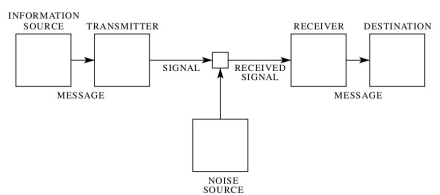

### Informação
- Na comunicação, uma mensagem é selecionada de um conjunto de mensagens possíveis.
- O processo escolha de uma mensagem é dentre as possíveis vinculada "informação". à escolha. Mas, como medir a quantidade de informação?
  - Se o conjunto de mensagens possíveis é pequeno, o processo de tentativa e erro para adivinhar a mensagem escolhida é mais simples. Pouca informação.
  - A vida real é um conjunto mais refinada: a escolha de algumas mensagens são mais prováveis que outras. Não seria conveniente derivar a informação de uma média? 

### Definição Matemática de Informação
- Se o número de elementos do conjunto é finito, esse n~umero ou qualquer função monotônica desse número pode ser considerada como uma média de informação quando da escolha de uma mensagem do conjunto. 

## internet

### História
- A internet foi criada em 1969, com o nome de ARPANET, com o objetivo de interligar computadores de universidades e centros de pesquisa dos EUA.
- A internet é uma rede de redes, que interliga computadores em todo o mundo.

### O que é a Internet?
Internet é uma rede de computadores que conecta centenas de milhôes de dispositivos computacionais através do mundo: 
- Computadores pessoais
- Servidores
- Laptops
- Smartphones
- Tablets
- Smart TVs
- Consoles de videogame
- Dispositivos de IoT
- Etc.

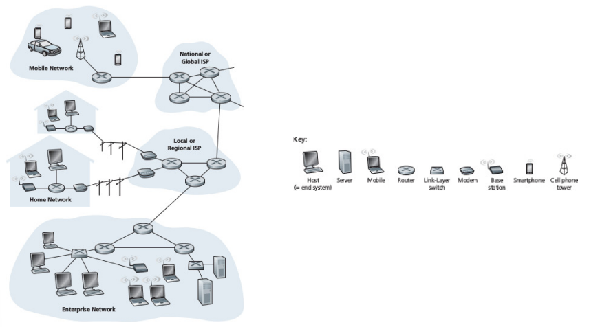


## Rede

### O que é Rede?
Rede é um conjunto de **enlaces de comunicações (links)** e **comutadores de pacotes (packets switches)**

> O enlace (link) é o componente de rede físico e lógico usado para interconectar computadores (hosts ou nós ) na rede e um protocolo de enlace é um conjunto de métodos e padrões que operam apenas entre nós de rede adjacentes de um segmento de rede.

- Meios físicos: cabos coaxiais, fios de cobre, fibra óptica, ondas de rádio e espectro eletromagnético.
- Provêem diferentes capacidades: bits/segundos.

### Tratamento de pacote: rede comutada a pacotes

> Comutação de pacotes é um paradigma de comunicação de dados em que pacotes (unidade de transferência de informação) são individualmente encaminhados entre os nós da rede através de ligações de dados tipicamente partilhadas por outros nós.

- Emissor segmenta os dados e adiciona cabeçalho a cada segmento.
- Pacotes formatados dessa forma são encaminhados pela rede ao destino.
- Destino reagrupa os segmentos para remontar o dado originalmente enviado.

## Comutadores
Os comutadores são elementos que permitem a interligação de diferentes enlaces. Eles coletam um pacote que chega através de um de seus enlaces e encaminha para o enlce de destino. 

Tipos de comutadores:
- roteadores: compõe o núcleo da rede;
- switches: provêem redes de acesso;

Denomina-se o caminho percorrido por um pacote por **rota** ou **caminho**.

## ISP: Internet Service Provider
O Provedor de Serviço de Internet (ISP) provê acesso de end systems à rede interconectada.

- Tipos: residencial, corporativo, móvel,ISP/HotSpot, etc.
- Cada ISP é, por sua vez, uma ree de comutação de pacotes e enlaces de comunicações.
- ISP provê acesso a provedores de conteúdo, conectando esses sites à internet.

### Protocolo de rede
- Entidades(hardware ou software) trocam mensagens e realizam ações (reagem!) decorrentes das mensagens trocadas.
- Todas as atividades da internet que envolvem duas ou mais entidades comunicantes são governadas por protocolos.
- Há padrões de sinalização de bits, controle de congestionamento, gerenciamento de rotas, etc.

### Protocolo TCP/IP
- O protocolo TCP/IP é o protocolo de comunicação padrão da internet. 
- O IP especifica o formato em que os pacotes são enviados e recebidos entre roteadores e end systems.

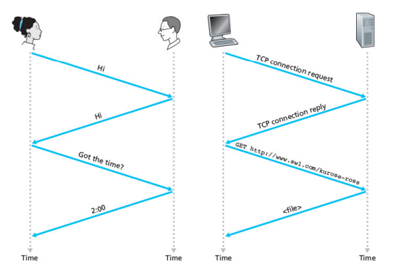

### DSL: Digital Subscriber Line
- DSL é uma tecnologia de comunicação que fornece uma conexão de dados digital sobre o fio de cobre do telefone local.
- Operadora de telefonia provê serviço no mesmo meio usado para prover chamadas de voz (telefone).
- A operadora afrefa o papel de ISP.
- O modem (MODulador/DEModulador) do cliente usa a linha telefônica para fechar enlace de dados com o Digital Subscriber Line Acess Multiplexer (DSLAM) da operadora.
- Modem converte dados digitais em sinais analógicos.
- DSLAM converte sinais analógicos em digitais e encaminha para a internet.

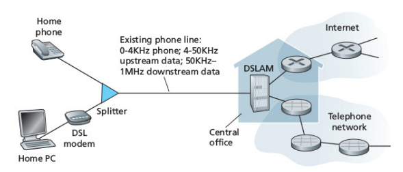

- Uso do par trançado de cobre para estabelecimento de enlace.
  - high-speed downstream: 50 kHz a 1 MHz
  - medium-speed upstream: 4 kHz a 50 kHz
  - canal telefônico: 0 a 4 kHz
  - Filtro de linha!
- Padrões de taxas de transmissão:
  - ITU 1999: 12 Mbps downstream, 1.8 Mbps upstream
  - ITU 2003: 24 Mbps downstream, 2.5 Mbps upstream
- ASDL: Asymmtric
- Aproveitamento da infraestrutura lógica de operadoras de TV a cabo
- Em geral, operadora de TV a cabo oferece serviço de internet.
- Sistema híbrido (HFC) Fibra  Coaxial são usados na rede de acesso.

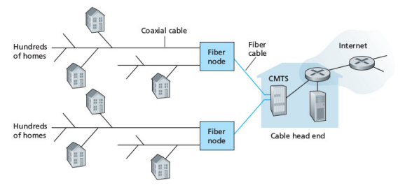

### FTTH: Fiber to the Home
- Direct Fiber: uma fibra por domicílio.
- Fibra compatilhada: mais comum.
- Arquiteturas: 
  - Active Optical Network (AON): Ethernet sobre fibra ótica;
  - Passive Optical Network (PON): Provida pela Verizon: FIOS (20 Mbps)

### WLAN: Wireless Local Area Network
- Dispositivos transmitem e recebem por rádio pacotes de pontos de acesso que, por sua vez, estão conectados à rede Internet.
- Poucas dezenas de metros do ponto de acesso.
- Padrões IEEE 802.11: WiFi, velocidades até 300 Mbps.

### Meio Físico
- Par traçado, cabo coaxial, fibra óptica, ondas de rádio, espectro eletromagnético.
- Meio guiado: ondas são confinadas em meio sólido. Fibra optica, par traçado, cabo coaxial.
- Meio não-guiado: atmosfera, espaço sideral.

#### Par Trançado - UTP (Unshielded Twisted Pair)
- Meio mais barato e comum, fuiado. 
- Um par de cabos isolados ajustados de acordo com um padrão aspiral.
- Por que aspiral? Reduz interferência eletromagnética de pares similares e colocalizados.
- Em geral, pares trançados são encontrados em cabos, envoltos com uma camada protetora.

#### Cabo Coaxial
- Dois condutores de cobre: malha e alma, concêntricos.
- Construção permite isolamento espacial e altas taxas de transmissão. 
- Muito comum para difusão de serviõs de TV a cabo: aproveitamento de infraestruturas.
- Meio compartilhado. Deslocamento de frequência para aproveitamento do meio.

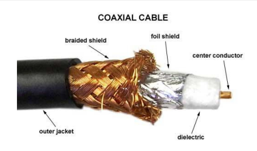

#### Fibra Óptica
- MEio fino, flexível, capaz de conduzir pulsos de luz que transportam bits.
- Uma fibra optica é capaz de prover altíssimas taxas, dezenas e centenas de Gbps.
- Muito conveniente para enlaces transoceânicos.
- Backbone (espina dorsal) da internet moderna.
- Vantagens:
  - Imunidade a interferências eletromagnéticas;
  - Atenuação muito baixa em longas distâncias (100 km);
  - "Difíceis" de serem "grampeadas";

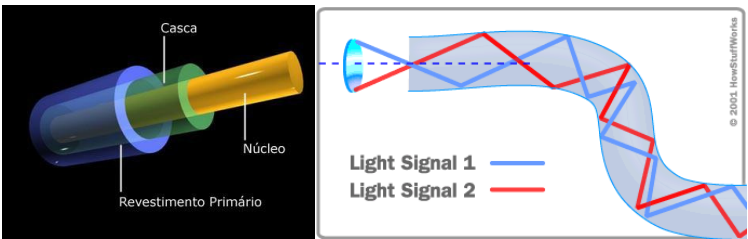

#### Ondas de Rádio
- Canais de rádio carregam sinais no espectro eletromanético.
- Vantagens:
  - Não é guiado: nãp requer lançamento de fios.
  - é permeável a obstáculos: atravessa paredes.
  - pode permitir mobilidade de seus usuários.
  - cobertura a distâncias consideráveis.
- Desvantagens:
  - problemas de propagação: perda de sinal no enlace, sombras, interferências por múltiplos percursos, interferências de outros sistemas.
- Classificação:
  - Curto elcance (1 ou 2 m): bluetooth, NFC, RFID;
  - Médio alcance (10 m a 1 km): WiFi.
  - Longo alcance ( > 1 km): celular.
  
  #### Canais por satélite
  - Conectam duas ou mais estações base que se comunicam com o satélite através de enlaces de microondas.

  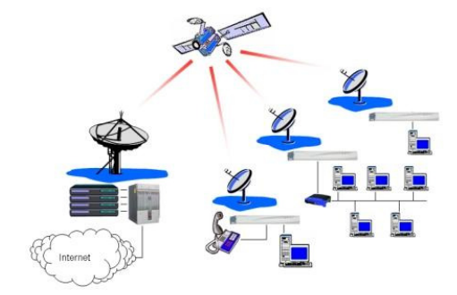

  ##### Geoestacionários (GEOS)
  - Ficam parados sobre a mesma região do planeta, girando com a mesma velocidade angular da Terra.
  - Orbitam a 36.000 km de altitude.
  - Atrasos de propagação de 280 ms.
  - Tavas de transmissão compatíveis com de enlaces DSL (Mbps).

  ##### Medium Earth Orbit Satellites (MEOS) - Satélites de Órbita Média
    - Orbitam a 20.000 km de altitude.
    - Atrasos de propagação de 140 ms.
    - Ficam em movimento em relação à Terra.

  ##### Low Earth Orbit Satellites (LEOS) - Satélites de Órbita Baixa
  - Orbitam mais próximo do planeta e não ficam, permanentemente, sobre a mesma região.
  - Podem se cmunicar com outros satélites: rede de satélites.

  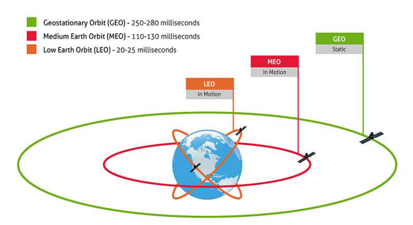

### Núcleo da Rede

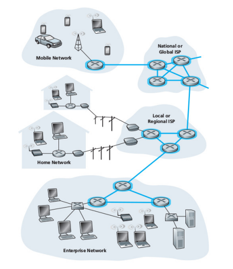

#### Comutação de Pacotes
- Hosts trocam mensagens entre si.
  - o conteúdo da mensagem é discricionário: pode ser mensagens de controle ou de dados.
  - É muito comum a necessidade de se quebrar uma mensagem longa em pedaços menores de dados chamados pacotes.
  - Entre a fonte e o destino, cada pacote viaja através de enlaces de comunicações e comutadores de pacotes (roteadores e switches de camada de enlace).
  - Pacotes são transmitidos através de cada enlace de comunicação a uma taxa igual à taxa máxima de transmissão do enlace.
  
#### Política Armazena e Encaminha

- Transmissão típica em rede comutada a pacote:
  - Comutador de pacotes deve receber um pacote inteiro antes de transmitir o primeiro bit do pacote no enlace de saída. 
  - Sejam N (numero de enlaces), L (comprimento da mensagem em bits) e R (taxa de transmissão de enlace). Define-se o atraso do ponto a ponto D_end-to-end.
  
  ```
    D_end-to-end = N * L / R
  ```

#### Atrasos de Enfileiramento e Perdas de Pacotes
- Cada comutador de pacotes interage com múltiplos enlaces.
- Para cada enlace, o comutador de pacotes possui um buffer de saída (também chamado de fila de saída) que armazena os pacotes que o roteador deve encaminhar pelo enlace

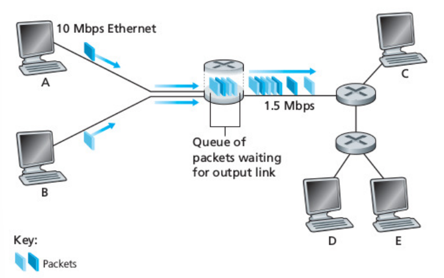

- Processamento típico do pacote:
  - Se o pacote que chega precisa sair por um enlace que está ocupado com a transmissão de outro pacote, o pacote esperaá (enfileirará) no buffer de saída.
  - Desse forma, além do atraso devido à politica armazena e encaminha, os pacotes sofrem por atrasos devido ao enfileiramento de pacotes.
  - Esses atrasos são variáveis e dependem do nível de congestionamento da rede.
  - Se o buffer de saída estiver completo (cheio), pode ocorrer o descarte/perda de pacote.

#### Tabelas de Encaminhamento e Protocolos de Roteamento

Como um roteador determin por qual enlace deve ser encaminhado um pacote?
- Cada host possui um endereço de IP.
  - Quando um host precisa enviar um pacote a um host destino, o host fonte precisa incluir o IP do destino no cabeçalho do pacote.
  - Quando o pacote alcança um roteador na rede, o roteador examina a porção do endereço  de destino do pacote e encaminha o pacote para o próximo roteador. 
- Cada roteador possui uma tabela de encaminhamento que mapeia o endereço de destino (ou porções do endereço de destino) para os enlaces de saída o roteador. 
- Quando o pacote alcança um roteador, o roteador examina o endereço e decide a partir do endereço de destino e de sua tabela de encaminhamento, qual é o enlace apropriado de saída.

Traçar rotas:
- Terminal Windows: ```tracert www.google.com```
- Terminal Linux: ```traceroute www.google.com```

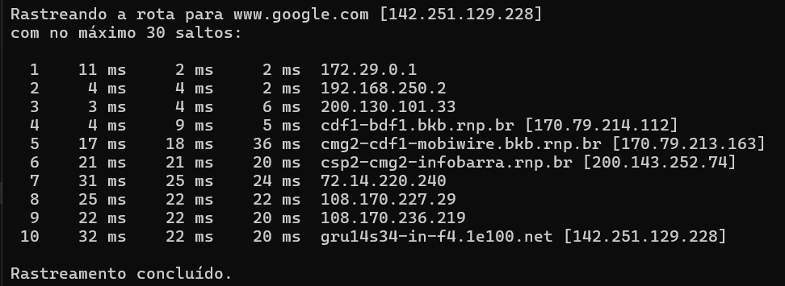

#### Comutação
Há duas abordagens básicas para prover fluxo de dados através de rede de enlaces e comutadores: comutação de circuitos e comutação de pacotes.

- **Comutação de circitos:** recursos necessários para prover comunicação entre os hosts "reservados" pela duração da sessão de comunicação entre os hosts. Exemplo: telefonica convencional.
  
  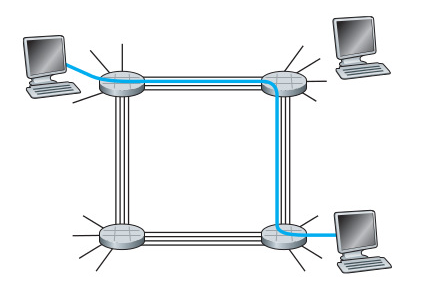

- **Comutação de pacotes:** recursos não reservados. As mensagens de sessão usam recursos sobre demanda -> podem ser submetidas a atrasos (provenientes de enfileiramentos).
- Em rede de comunicação de circuitos, há a reserva de uma taxa de transmissão constante nos enlaces da rede (uma fração da capacidade de transmissão de cada enlace): serviço com garantia taxa de transmissão. 

#### Multiplexação em rede de comutação de circuitos
FDM (Frequency Division Multiplexing):
  - O espectro de frequências de um enlace é dividido entre as conexões estabelecidas através do enlace.
  - O enlace dedica uma faixa de frequência para cada conexão e pela duração de uma conexão. 
  
  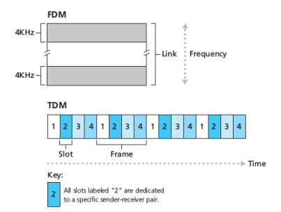

### Atrasos, Perdas e Vazão em redes de comutação de pacotes

#### Atrasos em redes de comutação de pacotes
- Pacote começa no host origem, passa por uma série de roteadores e finaliza sua jornada no host destino.
- Pacote sofre de vários tipos de atraso a cada nó ao longo de seu caminho.
- Desempenho de várias aplicações da Internet é intensamente afetado por atrasos na rede.
- Classificação:
  - Atraso de provessamento no nó
  - Atraso de enfileiramento
  - Atraso de transmissão
  - Atraso de propagação
  - Atraso total = o agregado dos atrasos supra.
  
  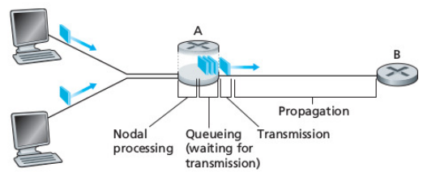

#### O que acontece com o pacote?
1- Pacote deixa computador e atravessa o enlace até o roteador A. 
2 - O roteador A examina o cabeçaljo do pacote e consulta tabela de encaminhamento para determinar o enlace de saída.
3 - Decidindo o enlace de saída, o pacote é encaminhado para a filha do enlace de saída.

Suponhamos que o pacote tenha que ser despachado para o roteador B:
- O pacote poderá ser transmitido pelo enlace se o enlace estiver livre (sem transmissão de pacotes no exato momento) e a fila estiver vazia.
- Se o enlace estiver ocupado ou outros pacotes estiverem enfileirados para saída pelo enlace, o novo pacote será incluído na fila de despacho.

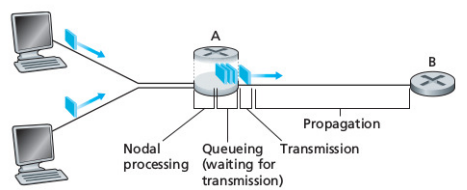.


#### Atraso de Processamento no Nó
- Tempo necessário para examinar o pacote e decidir para onde encaminhá-lo.
- Pode considerar: tempo necessário para conferir/verificar erros em nível de bit que podem ter afetado o pacote em sue trânsito entre o host emissor e o roteador A. 
- Atrasos de processamentos em roteadores de alta velocidade são da ordem de µs ou menos.
- Depois desse processamento, o retador direciona o pacote para a fila de saída do enlace que liga o rotador A ao B.

#### Atraso por Enfileiramento
- Atrado sofrido pelo pacote enquanto aguarda sua tranmissão pelo enlace.
- Depende do número de pacotes enfileirados e que aguardam por transmissão no enlace. Fila vzia, atraso 0.
- Podem ser da ordem de µs ou ms, na prática.

#### Atraso de Transmissão
- Intervalo de tempo que um pacote de L bits leva para ser conduzido através de um enlace de vazão/taxa de transmissão de R bits/s: L/R.
- Tipicamente, na ordem de µs ou ms.

#### Atraso de Propagação
- Atraso decorrente do tempo de propagação dos sinais eletromagnéticos que conduzem o pacote pelo enlace entre os rotadores A e B.
- Depende da velocidade de propagação do meio físico do enlace (fibra óptica, par trançado, etc): velocidade da luz.
- Distância *d* entre os roteadores, velocidade de propagação *s* do sinal eletromagnético, atraso de propagação = *d/s*.
- Podem ser da ordem de ms em WANs.

#### Diferenças entre atraso de transmissão e atraso de propagação
- Atraso de transmissão: tempo necessário para "empurrar" todos os bits do pacote para o enlace. Não possui correlaçõ alguma com a distância entre dois roteadores.
- Atraso de propagação: tempo necessário para "propagar" o primeiro bit do pacote do roteador A ao roteador B.
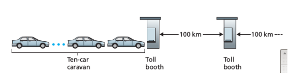

#### Atraso Total: o agregado dos atrasos supra.

```
  d_nodal = d_proc + d_fila + d_trans + d_prop
```

#### Atrasos de enfiliramento e perdas de pacotes
O atraso mais complexo de se modelar no cálculo do atraso nodal é o atraso de enfileiramento.

Diferentemente das outras parcelas componentes do atraso nodal, o atraso por enfileiramento pode variar pacote a pacote. 

- Se 10 pacotes chegam à uma fila vazia ao mesmo tempo, o primeiro pacote transmitido não sofrerá atraso algum enquanto o último pacote transmitido sofretá o maior atraso, pois deverá esperar todos os precedentes serem despachados.
- Estatística: atraso de enfileiramento médio, variância de enfileiramento, probabilidade de o atraso por enfileiramento exceder algum valor especificado, ...

#### Quando um atraso por enfileiramento é grande ou é insignificante?
- Para calcular, necessitamos de algumas informações: taxa com que o tráfego alcança a fila, taxa de transmissão de enlace, natureza do tráfego de entrada (período ou por rajadas) ...
- Modelo simples:
  - a (pacotes/s), R (taxa de transmissão em bits/s), L (tamanho do pacote em bits).
  - Taxa média de chegada dos dados = aL bits/s.
  - fila muito longa: capaz de conter uma quantidade  infinita de bits.
  - Intensidade de tráfego: aL/R.
  - aL/R > 1: acúmulo de pacotes na fila.

  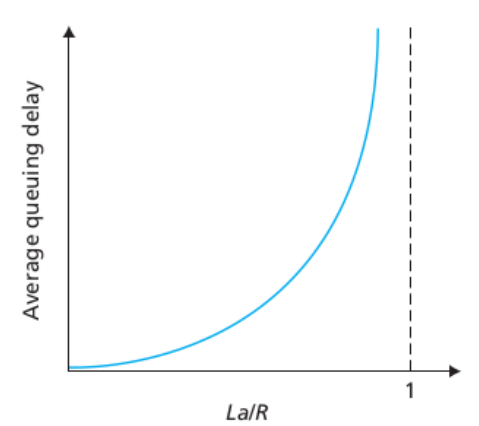

  ##### Exemplo 1: 
  Uma câmera de segurança transmite pacotes de vídeo a uma taxa de 50 pacotes por segundo para um servidor de armazenamento. Cada pacote tem um tamanho de 1200 bits. O enlace entre a câmera e o servidor possui uma taxa de transmissão de 1 Mbps. Qual é a intensidade de tráfego (𝜌) entre a câmera e o servidor?

  - a = 50 pacotes/s
  - L = 1200 bits
  - R = 1 Mbps = 10^6 bits/s
  - 𝜌 = aL/R = 50 * 1200 / 10^6 = 0.06

  ##### Exemplo 2: 
  do: Um servidor envia pacotes de dados de 1500 bits para um cliente a uma taxa de 200 pacotes por segundo. O enlace entre o servidor e o cliente possui uma capacidade de 10 Mbps. Qual é a intensidade de tráfego (𝜌)?

  - a = 200 pacotes/s
  - L = 1500 bits
  - R = 10 Mbps = 10^7 bits/s
  - 𝜌 = aL/R = 200 * 1500 / 10^7 = 0.03
  
#### Processo de chegada é um processo aleatório
  - Se a intensidade de tráfego for próxima de zero: enfileiramento pouco provável.
  - Intensidade de tráfego próxima de 1: capacidade de transmissão será excedida em alguns momentos: enfileramento.
  - Se a intensidade de tráfego for menor que a capacidade de transmissão, o comprimento da fila irá diminuir.
  - Intensidade de tráfego se aproximando de 1 -> aumento no atraso por enfileiramento.

Pag 67