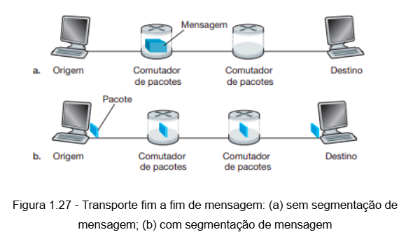

### Qual a diferença entre um hospedeiro e um sistema final? Site os tipos de sistemas finais. Um servidor web é um sistema final?

1. **Hospedeiro (Host)**: Refere-se a qualquer dispositivo de rede que possa executar aplicativos e participar de comunicação na rede. Inclui desktops, laptops, smartphones, servidores e outros dispositivos capazes de processar dados e fornecer ou consumir serviços.

2. **Sistema Final**: Esse termo também se aplica a dispositivos na borda da rede que realizam comunicação diretamente com outros sistemas finais, enviando e recebendo dados. O termo *sistema final* é mais usado para enfatizar a posição do dispositivo na rede, ou seja, fora do núcleo da rede e não envolvido no encaminhamento de pacotes entre redes.

3. Tipos de Sistemas Finais
Os sistemas finais incluem:
   - Computadores pessoais (PCs, laptops)
   - Smartphones e tablets
   - Servidores de diversos tipos (web, email, FTP)
   - Dispositivos de IoT (como câmeras de segurança, smart TVs)
   - Consoles de jogos

4. O Servidor Web como Sistema Final
Sim, um servidor web é um sistema final, pois ele está na borda da rede, fornecendo conteúdos e serviços para outros sistemas finais (clientes) que fazem requisições de páginas web ou outros recursos pela rede.

---

###  Por que padrões são inportantes para os protocolos?

Os padrões são essenciais para os protocolos de redes porque eles garantem que diferentes dispositivos e sistemas, mesmo de fabricantes variados, consigam se comunicar corretamente. Aqui estão os principais motivos:

1. **Interoperabilidade**: Padrões permitem que dispositivos e sistemas de diferentes fabricantes trabalhem juntos, criando uma rede onde todos conseguem “falar a mesma língua”.

2. **Confiabilidade**: Com padrões, os protocolos têm regras claras e bem documentadas, garantindo que a comunicação entre dispositivos seja consistente e previsível.

3. **Escalabilidade**: Padrões facilitam a expansão da rede, pois novos dispositivos podem ser adicionados sem problemas de compatibilidade.

4. **Eficiência de Desenvolvimento**: Os desenvolvedores podem focar em criar novas funcionalidades em vez de reinventar métodos básicos de comunicação, economizando tempo e recursos.

5. **Segurança**: Padrões trazem orientações para proteção dos dados, ajudando a evitar problemas como invasões e perdas de informação.

--- 

### O que é a taxa HFC? Taxa de transmissao HFC é dedicada ou é compartilhads entre usuários? É possível haver colisões na direção provedor-usuario de um cabal HFC? por que?
A taxa HFC (Hybrid Fiber-Coaxial) é uma tecnologia de acesso que combina fibras ópticas e cabos coaxiais para fornecer conexão de internet, TV e outros serviços a residências e empresas. Nessa estrutura, a fibra óptica é usada para o tronco principal, enquanto o cabo coaxial cobre a última milha até o cliente final.

1. Taxa de Transmissão HFC: Dedicada ou Compartilhada?
A taxa de transmissão em redes HFC é **compartilhada** entre os usuários de uma mesma área. Como vários usuários utilizam o mesmo cabo coaxial para acessar a internet, a largura de banda disponível é dividida entre eles, o que pode levar a variações na velocidade, especialmente em horários de pico, quando mais pessoas estão conectadas.

2. Possibilidade de Colisões na Direção Provedor-Usuário
Não há colisões na direção provedor-usuário em redes HFC, pois essa direção é **unidirecional** e controlada pelo provedor. O tráfego do provedor para os usuários é transmitido de forma coordenada, com pacotes de dados encaminhados diretamente para cada usuário sem interferência. Isso ocorre porque, no downstream (direção provedor-usuário), o provedor controla a alocação do canal e organiza o envio de dados de maneira ordenada.

3. Possibilidade de Colisões na Direção Usuário-Provedor
Por outro lado, no upstream (direção usuário-provedor), há um risco maior de colisões. Vários usuários compartilham o mesmo canal para enviar dados de volta ao provedor, e como podem tentar acessar o canal ao mesmo tempo, técnicas de controle de acesso, como o protocolo TDMA (Time Division Multiple Access), são necessárias para organizar esse tráfego e evitar colisões.

---

### O que é a taxa downstream e upstream?
Em redes de comunicação, as taxas **downstream** e **upstream** se referem à velocidade com que dados são transmitidos entre o provedor de internet e o usuário:

1. **Downstream**: É a velocidade com que os dados são transferidos do provedor para o usuário. Esse fluxo é o que permite atividades como assistir a vídeos, navegar na internet e fazer downloads. A taxa downstream geralmente é mais alta do que a upstream, pois o consumo de dados pelos usuários é maior nesse sentido.

2. **Upstream**: É a velocidade com que os dados são enviados do usuário para o provedor. Esse fluxo é necessário para atividades como enviar e-mails, fazer upload de arquivos e enviar dados para jogos online ou videoconferências. A taxa upstream costuma ser menor, já que o volume de dados enviado pelo usuário é geralmente mais baixo.

Ambas as taxas são importantes, mas a necessidade de uma maior taxa downstream é mais comum para atividades típicas de consumo de conteúdo.

--- 

### Cite alguns meios físicos utilizados para instalar a Ethernet.

Os meios físicos mais comuns utilizados para instalar a Ethernet incluem:

1. **Cabo de Par Trançado (Twisted Pair Cable)**: Este é o meio mais comum em redes Ethernet locais (LANs), com categorias como:
   - **Cat 5e**: Suporta velocidades de até 1 Gbps.
   - **Cat 6**: Suporta até 1 Gbps em distâncias maiores e até 10 Gbps em distâncias menores.
   - **Cat 6a** e **Cat 7**: Suportam até 10 Gbps com melhorias em desempenho e redução de interferência.

2. **Cabo Coaxial**: Utilizado em redes Ethernet antigas e em algumas redes específicas (como em sistemas de TV a cabo). Ainda é utilizado em redes Ethernet industriais ou em locais onde o par trançado pode sofrer com interferência.

3. **Fibra Óptica**: Utilizada para conexões Ethernet de alta velocidade em longas distâncias e em locais onde a interferência eletromagnética é um problema. As fibras ópticas podem ser:
   - **Monomodo (Single-Mode)**: Usada para longas distâncias, com maior largura de banda.
   - **Multimodo (Multi-Mode)**: Usada para distâncias mais curtas, como dentro de prédios ou campus.

Esses meios físicos oferecem diferentes vantagens em termos de velocidade, alcance e resistência à interferência, dependendo do ambiente de instalação e das necessidades da rede.

4. HFC (Hybrid Fiber-Coaxial): Como mencionado anteriormente, a tecnologia HFC combina fibras ópticas e cabos coaxiais para fornecer serviços de internet e TV a residências e empresas.

---

### Suponha que exista exatamente um comutador de pacotes entre um computador de origem e um de destino. As taxas de transmissão entre a máquina de origem e o comutador e entre este e a máquina de destino são R1 e R2 , respectivamente.

#### a) Admitindo que um roteador use comutação de pacotes do tipo armazena-e-reenvia, qual é o atraso total fim a fim para enviar um pacote de comprimento L? (Desconsidere formação de fila, atraso de propagação e atraso de processamento.)

> Atraso total = L/R1 + L/R2

### Qual é a vantagem de uma rede de comutação de circuitos em relação a uma de comutação de pacotes? Quais são as vantagens da TDM sobre a FDM em uma rede de comutação de circuitos?

Vamos explorar as vantagens de uma rede de **comutação de circuitos** em relação a uma de **comutação de pacotes** e as vantagens do **TDM** (Time Division Multiplexing) sobre o **FDM** (Frequency Division Multiplexing) em redes de comutação de circuitos.

##### Vantagens de uma Rede de Comutação de Circuitos sobre uma de Comutação de Pacotes

1. **Qualidade de Serviço (QoS) Garantida**: Em uma rede de comutação de circuitos, um caminho dedicado é estabelecido entre origem e destino antes do início da comunicação. Isso significa que a largura de banda é garantida para o usuário durante toda a comunicação, proporcionando uma conexão mais estável e com menos variação de latência, o que é essencial para aplicações que precisam de transmissão contínua, como chamadas de voz e videoconferências.

2. **Sem Colisões**: Como o canal é dedicado exclusivamente ao usuário durante a comunicação, não há competição com outros usuários. Isso elimina o risco de colisões de dados, que podem ocorrer em redes de comutação de pacotes quando vários dispositivos tentam transmitir ao mesmo tempo.

3. **Previsibilidade**: Em redes de comutação de circuitos, o atraso é geralmente mais previsível, pois o caminho é estabelecido e reservado antes da comunicação. Isso é particularmente vantajoso para serviços que exigem baixa latência e alta consistência, como chamadas telefônicas.

4. **Fluxo Contínuo de Dados**: A comutação de circuitos é ideal para dados transmitidos de forma contínua e em tempo real, como em transmissões de áudio e vídeo. O canal permanece ativo durante toda a comunicação, sem necessidade de segmentar os dados em pacotes, como acontece em redes de comutação de pacotes.

### Vantagens do TDM sobre o FDM em uma Rede de Comutação de Circuitos

1. **Uso Mais Eficiente de Frequências**: Em TDM, múltiplos usuários compartilham o mesmo canal de frequência, cada um utilizando um intervalo de tempo específico. Isso permite que todos os usuários utilizem a mesma frequência, enquanto o FDM exige uma faixa de frequência separada para cada usuário, o que pode consumir uma quantidade maior de espectro.

2. **Menor Interferência**: Como cada usuário ocupa um intervalo de tempo diferente em TDM, não há risco de interferência entre os usuários, enquanto no FDM há sempre a possibilidade de interferência entre faixas de frequência adjacentes, exigindo o uso de filtros para minimizá-la.

3. **Simplicidade na Implementação**: TDM geralmente é mais fácil de implementar do que FDM, pois não necessita de divisores de frequência e filtros para separar canais, o que reduz a complexidade do sistema.

4. **Facilidade de Alocação de Largura de Banda**: Em TDM, é mais fácil ajustar a quantidade de tempo alocado para cada usuário, permitindo uma alocação dinâmica de largura de banda. No FDM, uma vez que as frequências são divididas entre os usuários, é mais difícil fazer ajustes sem reconfigurar todo o sistema.

Em resumo, em redes de comutação de circuitos, o TDM pode ser preferido ao FDM devido ao uso mais eficiente do espectro, menor risco de interferência e maior flexibilidade na alocação de recursos. A comutação de circuitos, por sua vez, oferece vantagens de qualidade de serviço e previsibilidade em relação à comutação de pacotes, sendo ideal para transmissões contínuas e sensíveis a atrasos.

### Suponha que usuários compartilhem um enlace de 2 Mbits/s e que cada usuário transmita continuamente a 1 Mbit/s, mas cada um deles transmite apenas 20% do tempo.
#### Quando a comutação de circuitos é utilizada, quantos usuários podem ser admitidos?
1. Para o restante deste problema, suponha que seja utilizada a comutação de pacotes. Por que não haverá atraso de fila antes de um enlace se dois ou menos usuários transmitirem ao mesmo tempo? Por que haverá atraso de fila se três usuários transmitirem ao mesmo tempo?
> Se dois ou menos usuários transmitirem ao mesmo tempo, a taxa de transmissão combinada é, no máximo, 2 Mbits/s (1 Mbit/s por usuário). Isso corresponde exatamente à capacidade total do enlace, de 2 Mbits/s. Nesse caso, o enlace pode suportar a transmissão sem formar fila, pois a demanda não excede a capacidade.
> Se três usuários tentarem transmitir ao mesmo tempo, a taxa combinada de transmissão será 3 Mbits/s, o que excede a capacidade do enlace (2 Mbits/s). Quando a demanda ultrapassa a capacidade, os dados adicionais devem aguardar na fila, causando um atraso de fila.

2. Determine a probabilidade de um dado usuário estar transmitindo.
>Cada usuário transmite apenas 20% do tempo, o que significa que a probabilidade de um usuário estar transmitindo em um dado momento é 0,2 (ou 20%).

3. Suponha agora que haja três usuários. Determine a probabilidade de, a qualquer momento, os três usuários transmitirem simultaneamente. Determine a fração de tempo durante o qual a fila cresce.

>Probabilidade de três usuários transmitirem simultaneamente = 0.2 x 0.2 x 0.2 = 0.008 (ou 0.8%)

### Descreva as tecnologias de acesso sem fio mais populares atualmente. Faça uma comparação entre elas.
> wi-fi
> bluetooth
> 3g/4g/5g
> zigbee
> lora
> rfid
> nfc

### Admitindo que um roteador use comutação de pacotes do tipo armazena-e-reenvia, qual é o atraso total fim a fim para enviar um pacote de comprimento L? (Desconsidere formação de fila, atraso de propagação e atraso de processamento.)

Desconsiderando o atraso de fila, propagação e processamento, pocemos calcular o atraso de transmissão. L/R1 é o atraso de transmissão da origem ao roteador, e L/R2 é o atraso de transmissão do roteador ao destino. Portanto, o atraso total fim a fim para enviar um pacote de comprimento L é a soma desses dois atrasos:

Atraso total = Atraso de transmissão da origem ao roteador + Atraso de transmissão do roteador ao destino

Atraso total = L/R1 + L/R2

### O que é TCP? o que é IP? O que é o TCP/IP?

**TCP (Transmission Control Protocol)** e **IP (Internet Protocol)** são dois dos principais protocolos que possibilitam a comunicação na internet. O conjunto deles, **TCP/IP**, é a base para a comunicação em redes de computadores.

O **TCP** é um protocolo de nível de transporte responsável por garantir uma **transmissão confiável** de dados entre dois dispositivos. 

O **IP** é um protocolo de nível de rede que define como os pacotes de dados são endereçados e roteados entre dispositivos em diferentes redes. 

**TCP/IP** é o conjunto de protocolos (ou pilha de protocolos) que combina o TCP e o IP para criar uma comunicação robusta e eficiente em redes, especialmente na internet. Juntos, eles funcionam da seguinte forma:

### Quais são as cinco camadas da pilha de protocolo da Internet? Quais as principais responsabilidades de cada uma dessas camadas?

A pilha de protocolos da Internet, também conhecida como modelo TCP/IP, possui **cinco camadas** principais. Cada camada tem responsabilidades específicas para assegurar a comunicação eficiente entre dispositivos em uma rede. Vamos a elas:

1. Camada Física
- **Responsabilidade**: Transmitir os dados brutos na forma de sinais elétricos, ópticos ou de rádio entre dispositivos conectados fisicamente. 
- **Função Principal**: Define os meios físicos de transmissão (como cabos, ondas de rádio) e a forma como os bits (0s e 1s) são representados e enviados pelo meio.

1. Camada de Enlace (Link Layer)
- **Responsabilidade**: Assegurar a transmissão de dados dentro de uma rede local (LAN).
- **Função Principal**: Divide os dados em quadros (frames) e gerencia a entrega dentro da mesma rede. Inclui a detecção e correção de erros de transmissão, controle de acesso ao meio físico (como Ethernet e Wi-Fi) e endereçamento físico (endereços MAC).

1. Camada de Rede (Network Layer)
- **Responsabilidade**: Definir o endereçamento lógico e o roteamento dos pacotes entre redes diferentes.
- **Função Principal**: Utiliza o protocolo IP para encaminhar pacotes de dados entre diferentes redes, identificando os dispositivos por endereços IP e determinando a melhor rota para o pacote alcançar o destino.

4. Camada de Transporte (Transport Layer)
- **Responsabilidade**: Gerenciar a comunicação ponta a ponta entre os dispositivos de origem e destino.
- **Função Principal**: Divide os dados em segmentos e garante que eles sejam entregues de forma confiável e na sequência correta (com o protocolo TCP) ou, em alguns casos, sem garantia de entrega (com o protocolo UDP). Essa camada cuida de aspectos como controle de fluxo, controle de congestionamento e confiabilidade.

5. Camada de Aplicação (Application Layer)
- **Responsabilidade**: Fornecer interfaces para o usuário e para as aplicações interagirem com a rede.
- **Função Principal**: Inclui os protocolos que suportam a comunicação direta com as aplicações, como HTTP (para navegação na web), SMTP (para e-mail), FTP (para transferência de arquivos) e DNS (para resolução de nomes de domínio).

 ##### Resumo das Camadas e suas Funções

| Camada            | Responsabilidade                              | Protocolos Exemplos         |
|-------------------|-----------------------------------------------|-----------------------------|
| **Física**        | Transmissão de bits pelos meios físicos       | Cabos, fibras, ondas de rádio |
| **Enlace**        | Transmissão de dados em redes locais          | Ethernet, Wi-Fi, MAC        |
| **Rede**          | Roteamento de pacotes entre redes             | IP                          |
| **Transporte**    | Comunicação ponta a ponta e confiabilidade    | TCP, UDP                    |
| **Aplicação**     | Interfaces de comunicação para aplicações     | HTTP, FTP, SMTP, DNS        |

### Em redes modernas de comutação de pacotes, inclusive a Internet, o hospedeiro de origem segmenta mensagens longas de camada de aplicação (por exemplo, uma imagem ou um arquivo de música) em pacotes menores e os envia pela rede. O destinatário, então, monta novamente os pacotes restaurando a mensagem original. Denominamos esse processo segmentação de mensagem. A Figura 1.27 ilustra o transporte fim a fim de uma mensagem com e sem segmentação. Considere que uma mensagem de 8 × 10⁶ bits de comprimento tenha de ser enviada da origem ao destino na Figura 1.27. Suponha que a velocidade de cada enlace da figura seja 2 Mbits/s. Ignore atrasos de propagação, de fila e de processamento.

